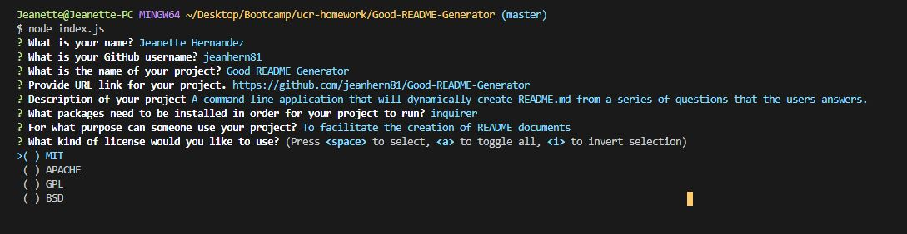
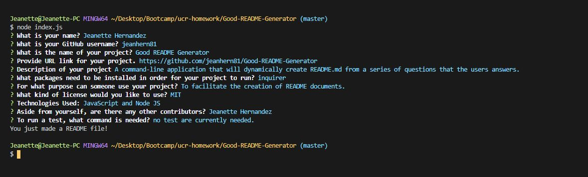

# Good README Generator 

# Demo

---

## Description
A command-line application that will dynamically create README.md from a series of questions that the users answers.

---

## Table of Contents
- [Installation](#installation)
- [Usage](#usage)
- [License](#license)
- [Tests](#tests)
- [Contributors](#contributors)

---

## Installation
Packages required to run this program are: 
inquirer

---    
## Usage
Examples of how to use this program: 
To facilitate the creation of README documents

---

## License
MIT

---

## Tests
To test, run the following command:
no test are currently needed.

---

## Contributors
Jeanette Hernandez

---

## Contact
    
 
    

    
View the project in GitHub at: https://github.com/jeanhern81/Good-README-Generator.